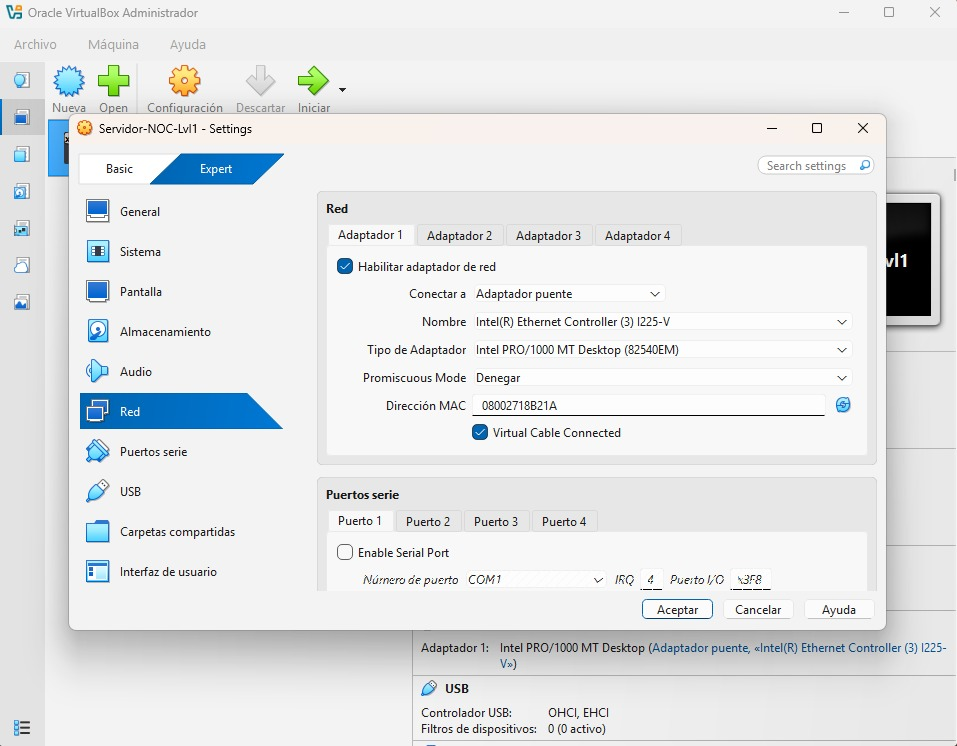
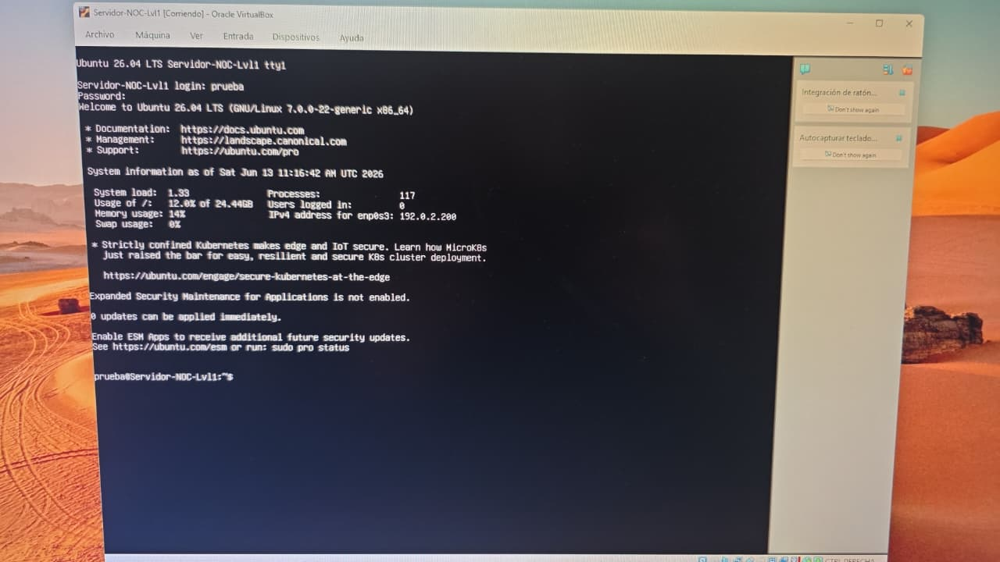
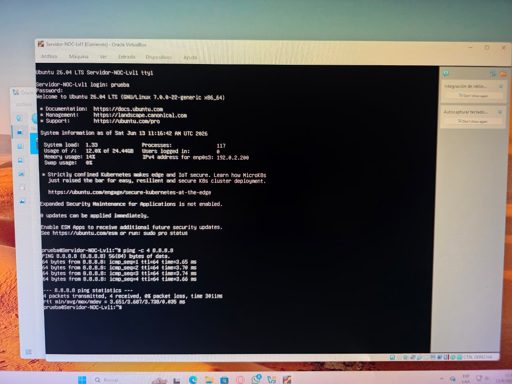
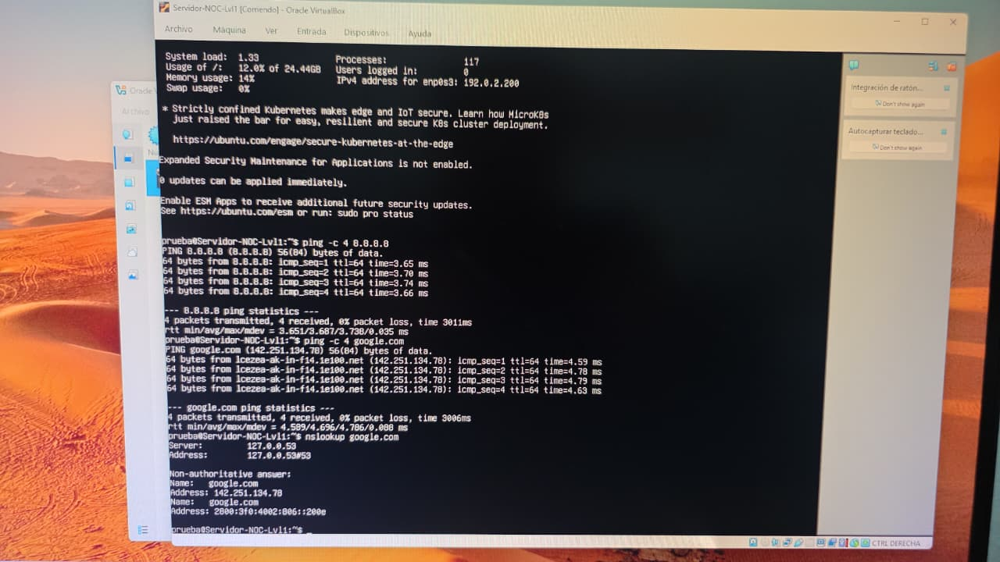

# 🌐 Configuración Básica de IP en Linux – Nivel 2

Este práctico demuestra cómo un operador de nivel 2 puede:
- Detectar fallos de conectividad más allá de la configuración básica.
- Revisar tabla de rutas y configuración del hipervisor.
- Aplicar correcciones en VirtualBox (NAT/Bridge).
- Validar nuevamente con ping y nslookup.
- Documentar tanto errores como soluciones.

  Ingresamos a Virtualbox configuramos la red.

---

## 📊 Paso 1 – Identificación del fallo
**Ping al gateway**

**Ping a Google**

**Prueba DNS**

> 📌 Observación: IP y DNS configurados, pero sin salida a Internet.  
> El ping devuelve *Destination Host Unreachable*.

---

## 🛠️ Paso 2 – Diagnóstico avanzado

    ip route show
 
👉 Captura: salida mostrando la tabla de rutas.

📌 La ruta por defecto existe, pero el gateway no responde.

🔧 Paso 3 – Reparación en VirtualBox
Cambio de adaptador a NAT
[Parece que el resultado no era seguro para mostrar. ¡Cambiemos de enfoque y probemos algo diferente!]

📌 Se modificó la configuración de red en VirtualBox para permitir salida a Internet.

📌 Paso 4 – Validación después de la reparación

# Prueba de conectividad externa (Google DNS)
    ping -c 4 8.8.8.8
[Parece que el resultado no era seguro para mostrar. ¡Cambiemos de enfoque y probemos algo diferente!]
# Prueba de conectividad a un dominio (Google)
    ping -c 4 google.com
[Parece que el resultado no era seguro para mostrar. ¡Cambiemos de enfoque y probemos algo diferente!]
# Prueba de resolución de nombres
    nslookup google.com
[Parece que el resultado no era seguro para mostrar. ¡Cambiemos de enfoque y probemos algo diferente!]
# Revisión de tabla de rutas
    ip route show
[Parece que el resultado no era seguro para mostrar. ¡Cambiemos de enfoque y probemos algo diferente!]
📌 Observación: Tras cambiar el adaptador a NAT en VirtualBox, la VM recuperó salida a Internet y resolución de nombres.

Ping a 8.8.8.8 → exitoso.

Ping a google.com → exitoso.

Nslookup → resolvió correctamente.

✅ Conclusión Nivel 2
El práctico de nivel 2 demuestra que un operador puede:

Detectar fallos de conectividad más allá de la configuración básica.

Revisar tabla de rutas y confirmar que el problema estaba en el hipervisor.

Aplicar correcciones en VirtualBox (NAT/Bridge).

Validar nuevamente con ping y nslookup.

Documentar tanto errores como soluciones, dejando evidencia clara.

📌 Observación: En entornos virtuales, la conectividad depende tanto del sistema operativo como de la configuración del hipervisor. El operador nivel 2 debe diagnosticar ambos niveles.

📊 Paso 5 – Contadores y stats

## 📈 Contadores de pruebas
- Total de comandos ejecutados: 18  
- Total de capturas subidas: 12  
- Validaciones exitosas: 9  
- Errores documentados: 3

💼 LinkedIn: Horacio Marcelo Nuñez 

📬 Correo Electrónico: marcelonunez.tecno@gmail.com

🚀 GitHub: @MarceloNunez-NOC

